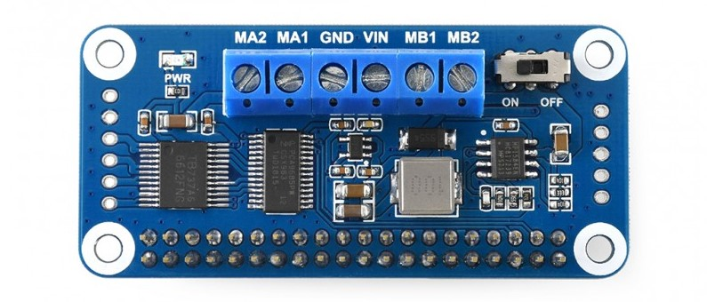

CSC 615 Embedded Linux - Team 0xFF PI 12/13/22

# Embedded Linux - Group Term Project
# FALL 2022

|
 |
 |
| --- | --- |
| **Github Repository** [https://github.com/CSC615-2022-Fall/csc615-term-project-faiyazc](https://github.com/CSC615-2022-Fall/csc615-term-project-faiyazc) |
| **Members** | **Github Usernames** |
| Hector M. Lua | hectormagallanes |
| Faiyaz Chaudhury | faiyazc |
| Briget Soriano | b-ts-o |
| Emanuel Francis | Emanuelf-sfsu |

###

## Table of Contents

**[Table of Contents](#_ucrkiug4jsw) 2**

**[Task Description](#_rh7m2fobpu9m) 3**

**[Building the Robot](#_55bi82vaezh0) 3**

[Parts / Sensors](#_mbs6szieu54k) 3

[How was bot built?](#_wjile0hxye3x) 5

[Libraries/Software](#_6202y0mz3dql) 10

[Code Flowchart](#_a0psv2btgtcw) 11

[Pin Assignments](#_dvxhh2g467kn) 12

[Hardware Diagram](#_h34iwdcqatwp) 13

**[Reflections](#_rf3da6gal691) 14**

[Issues](#_myisp96nep34) 14

[Solutions](#_14ko548rvd5) 15

##

##

##

##

##

##

## Task Description

The aim of this project was to create a robot/car using a Raspberry Pi 4 and a range of different sensors, wheels, and motors. Once the vehicle is assembled it must traverse through an obstacle course. The robot/car will follow a solid black line and navigate around objects on the path.

## Building the Robot

### Parts / Sensors

- Raspberry Pi 4
 
  - This part is the main "brains" of the robot. The Pi is able to gather all of the data from the sensors. This allows the robot to make its own decision based on its surroundings and the requirements of the project.
  - Specifications
    - Broadcom BCM2711, Quad core Cortex-A72 (ARM v8) 64-bit SoC @ 1.5GHz
    - 2.4 GHz and 5.0 GHz IEEE 802.11ac wireless, Bluetooth 5.0, BLE Gigabit Ethernet.
    - More information found [here](https://www.raspberrypi.com/products/raspberry-pi-4-model-b/specifications/)
- Waveshare Motor Driver HAT for Raspberry Pi (2)
 
  - By stacking the two Motor Driver HATs the Raspberry Pi is able to control all 4 of the motors.
  - Each Motor Driver HAT had its own unique I2C address.
  - Specifications
    - Standard Raspberry Pi 40 PIN GPIO extension header
    - Onboard PCA9685 chip, provides 12-bit hardware PWM to adjust motor speed
    - More information found [here](https://www.waveshare.com/motor-driver-hat.htm).
- Lidar - Slamtech RPLIDAR A1
 
  - The robot depends on the Lidar for obstacle avoidance. The information recorded from the Lindar helps the robot navigate around objects.
  - Specifications
    - 360 Degree Omnidirectional Laser Range Scanning
    - Configurable Scan Rate from 2-10Hz
    - More information found [here](https://www.slamtec.com/en/Lidar/A1).
- TCRT5000 Infrared Reflective Sensor IR (2)
 
  - Specifications
    - Detecting the reflected distance: 1mm ~ 25mm applicable
    - Working voltage of 3.3V-5V
    - More information found [here](https://www.amazon.com/HiLetgo-Channel-Tracing-Sensor-Detection/dp/B00LZV1V10).
- Brushed DC Motor Gearmotor (4)
 
  - Specifications
    - 200 RPM
    - 3 ~ 6VDC
    - More information found [here](https://www.digikey.com/en/products/detail/adafruit-industries-llc/3777/8687221?utm_adgroup=Motors%20-%20AC%2C%20DC&utm_source=google&utm_medium=cpc&utm_campaign=Shopping_Product_Motors%2C%20Solenoids%2C%20Driver%20Boards%2FModules_NEW&utm_term=&utm_content=Motors%20-%20AC%2C%20DC&gclid=Cj0KCQiA7bucBhCeARIsAIOwr--rpbJmqeXcYmGrkISqyiq37UTOlwCHT-pkvkphqX3v1M9j-Mc1qSIaAoysEALw_wcB).

- Button (1)
- Small Breadboard (1)
- Phone battery charger (1)
- Batteries (3)
- Acrylic Chassis kit & Mounts
  - More information found [here](https://www.amazon.com/wheel-layer-Chassis-Encoder-Arduino/dp/B06VTP8XBQ/ref=asc_df_B06VTP8XBQ/?tag=hyprod-20&linkCode=df0&hvadid=312134123917&hvpos=&hvnetw=g&hvrand=10552638582211431139&hvpone=&hvptwo=&hvqmt=&hvdev=c&hvdvcmdl=&hvlocint=&hvlocphy=9061255&hvtargid=pla-569278336219&psc=1)

### How was bot built?

The robot was built in 3 stages.

- Mechanical assembly
  1. This included assembling the chassis and attaching motors, sensors, and wheels. We also had to drill holes into the acrylic plate to secure the sensors.

 

_(This picture was taken on Thanksgiving break.)_

Final look of the car

- Electrical assembly
  1. The robot uses two separate battery packs to power the motors, sensors, and raspberry pi.

- Programming

1. Write engine driver code: From the sample WaveShare code we are using the PCA9685, DEV\_Config, dev\_hardware\_i2c, and sysfs\_gpio files. Most were modified to support multiple motor HATs.
  1. Remove unnecessary code from DEV\_Config files:
    1. Removed all logic related to the WiringPi and BCM2835 libraries
    2. Removed DEV\_Digital\_Write(), DEV\_Digital\_Read(), DEV\_SPI\_WriteByte() and DEV\_SPI\_Write\_nByte()
  2. Create new EngineDriver files to hold engine functionality
    1. Implement first draft of core functions:
      1. engine\_init() → Initialize bottom HAT (addr 0x49)
      2. engine\_exit() → close HAT's file descriptor
      3. engine\_run() → run a specific motor at a specific speed and direction
      4. engine\_stop() → stop a specific motor from running
  3. Modify engine functions and WaveShare libraries to support multiple Motor HATs:
    1. Replace the HARDWARE\_I2C struct from the dev\_hardware\_i2c files with a new engine struct in EngineDriver files to hold a separate file descriptor for each Motor HAT.
    2. PCA9685 modifications:
      1. PCA9685\_Init() → returns the file descriptor of the Motor HAT being initialized
      2. The rest of the functions take an extra int parameter for the file descriptor to distinguish which Motor HAT to operate on
    3. DEV\_Config modifications:
      1. DEV\_I2C\_Init() → returns the file descriptor of the Motor HAT being initialized
      2. DEV\_ModuleInit() → returns the file descriptor for the system
      3. I2C\_Write\_Byte(), I2C\_Read\_Byte() and DEV\_ModuleExit()→ take an extra int parameter for the file descriptor to distinguish which Motor HAT to operate on
    4. dev\_hardware\_i2c modifications:
      1. DEV\_HARDWARE\_I2C\_begin() → returns the file descriptor of the Motor HAT being initialized
      2. The rest of the functions take an extra int parameter for the file descriptor to distinguish which Motor HAT to operate on
    5. EngineDriver modifications:
      1. engine\_init() → initialize the file descriptor values of the engine struct. Calls DEV\_ModuleInit() for the system file descriptor. Initialize each Motor HAT and set their PWM frequency to 100
      2. engine\_exit() → close all file descriptors in the engine struct
      3. engine\_run() → run a specific motor from a specific Motor HAT
      4. engine\_stop() → stop a specific motor from a specific Motor HAT from running
  4. Implement car movement functions in EngineDriver.c:
    1. runFL(), runFR(), runRL(), runRR() functions to control each individual motor
    2. engine\_strafe\_left(), engine\_strafe\_right(), engine\_run\_cw() and engine\_run\_ccw()
2. LiDAR Handling
  1. Modify LiDAR driver code
    1. Remove unnecessary print statements in main.cpp for ultra\_simple
  2. Write handler functions
    1. lidarInit() → initialize file descriptor for reading lidar values. Returns a copy of the file descriptor for usage in functions.
    2. lidarTerminate() → close lidar file descriptor
    3. readLidarWriteGlobal() → read the file descriptor opened by lidarInit(). Tokenize output and check to see if an object is in front of the car and/or behind the car.
3. Test engine functionality
  1. Obstacle avoidance
    1. obstacleAvoidance() → while an object is in front, strafe left. Then, drive straight forward until the object is not detected behind the car. Then strafe right until the right line sensor detects the line and the left one does not. Then stop the car.
4. Write line sensor code:
  1. Global variables lineLeft and lineRight hold the value output by the line sensors. They are updated by lineSensorLeftRoutine() and lineSensorRightRoutine() respectively.
  2. In the main execution loop inside main.c, the values of lineLeft and lineRight determine how the car moves
    1. While no line is detected go straight
    2. While left line sensor detects line, turn counterclockwise
    3. While right line sensor detects line, turn clockwise
    4. If both sensors detect line, keep current motion until line is centered

### Libraries/Software

- rpLidar C++ library, modified by Faiyaz
- PCA9685, DEV\_Config, dev\_hardware\_i2c, sysfs\_gpio

### Code Flowchart

 

### Pin Assignments

| GPIO Pin | Use |
| --- | --- |
| 26 | Button |
| 4 | Front left line sensor |
| 23 | Front right line sensor |

### Hardware Diagram

## 

##

##

##

##

##

## Reflections

### Issues

1. Our batteries kept draining very quickly. We suspect that keeping the LiDAR on during development time is what caused this issue.
2. When first using the batteries to power all 4 motors, the top Motor HAT burned out likely because of a faulty ground connection to the other HAT.
 
3. We originally tried to use a single acrylic board to house the sensors, electronic components, and batteries. But there was not enough room for all the electronics. The battery packs and the raspberry pi also blocked the Lidar sensor's field of view.
 
4. The LiDAR drivers presented an initial learning curve since they were written in C++, and the installation of the device, while documented, was not entirely straightforward.

###

### Solutions / Successes

1. The battery draining issue became much more apparent once we started to run the final course. The best that we could do at the time was to swap out the low batteries with fresh ones and disconnect the battery pack when it was not in use.
2. On the old Motor HAT we used jumper wires to supply power to the top Motor HAT. On the new Motor HAT we chose to solder the wires directly to the Motor HAT board.
3. We decided to go with the two layer chassis design. Using metal standoffs, we added the second acrylic board just enough to fit the motors and the raspberry pi's battery pack. We also use the metal standoffs to raise the lidar above the other electronics.
 
4. After installation of both the driver for the USB and the A1 LiDAR software, we ran extensive tests on the built software. Using the LiDAR was possible by researching pipe(), fork(), exec(), and popen() to see how the best way to call the C++ built code in C. I talked to Professor Bierman about it, and he suggested using pipe() since that is how it was done in the past, but I found that using popen() was more straightforward since it handles the fork()ing and exec()ing of a specified command.

|
 | 0 |
| --- | --- |